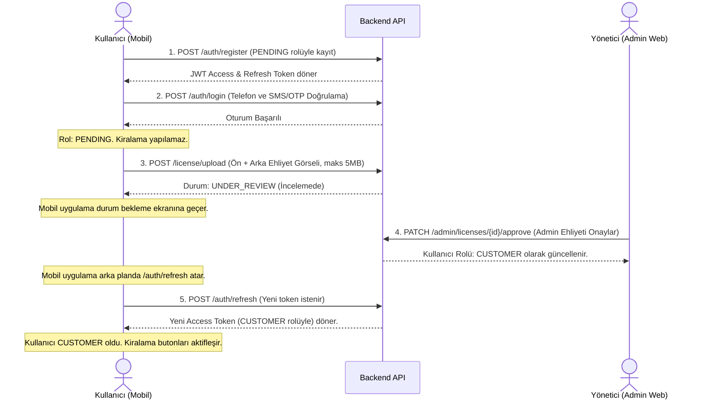

# RenCar Kayıt ve Ehliyet Doğrulama (Onboarding & License Validation) Akışı

Bu doküman, sisteme ilk kez katılan bir kullanıcının kayıt olma, doğrulama süreçleri ve ehliyet onay adımlarını tanımlar. `rencar.pdf` tasarım sayfaları ile `openapi.json` servis kontratları arasındaki entegrasyonu detaylandırır.

---

## 1. Onboarding İş Akış Diyagramı

---

## 2. Onboarding Adımları Detayları

### Adım 2.1: Kayıt ve Giriş (Auth & OTP Verification)
- **Ekran Tasarımları (`rencar.pdf` Sayfa 3-6):** Kullanıcı telefon numarasını girer, SMS doğrulama kodu (`OTP`) alır ve girer.
- **Teknik Karşılık:**
  - Yeni kayıt olan her kullanıcı `POST /auth/register` ile varsayılan olarak **PENDING** rolüyle açılır.
  - Giriş yapıldığında (`POST /auth/verify-otp` ile OTP doğrulandıktan sonra), uygulama JWT token'ları yerel güvenli alana (`EncryptedSharedPreferences` veya `DataStore`) kaydeder.

### Adım 2.2: Ehliyet Yükleme ve Gönderme
- **Ekran Tasarımı (`rencar.pdf` Sayfa 7-8):** 3 adımdan oluşan bir doğrulanma sihirbazı gösterilir: "1. Ehliyet", "2. Selfie", "3. Onay". Ehliyetin ön yüzü ve arka yüzü kamera ile çekilir veya galeriden seçilir.
- **API İstek Detayı:**
  - **Uç nokta:** `POST /license/upload` (Multipart/form-data)
  - **Dosya Kısıtları:** Sadece `jpg/png` formatında, her bir dosya boyutu maksimum **5MB** olmalıdır. Aksi durumda API `400 Bad Request` veya `413 Payload Too Large` dönecektir.
  - **Yanıt:** Yükleme tamamlandığında kullanıcının ehliyet durumu `UNDER_REVIEW` (İncelemede) olarak güncellenir.

### Adım 2.3: Onay Bekleme ve Dinamik Rol Güncelleme
- **Ekran Tasarımı:** Kullanıcı profil ekranında (`rencar.pdf` Sayfa 25) veya ana ekrana girdiğinde "Ehliyet İncelemede" durum kartını görür.
- **Sessiz Token Yenileme (Silent Refresh) Mantığı:**
  - Kullanıcı ehliyeti yönetici tarafından onaylandığında backend'deki rolü **CUSTOMER** olur ancak mobil uygulamadaki mevcut access token hala eski rolü (`PENDING`) taşımaktadır.
  - Uygulama, `/license/status` kontrolü yaptığında durumun `APPROVED` olduğunu tespit ettiği an, şifre girmeden sessizce `POST /auth/refresh` atarak **yeni CUSTOMER yetkili JWT token'ı** alır.
  - Arayüz anında güncellenir; haritadaki "En Yakın Aracı Bul" butonu ve kiralama onay butonları aktif hale gelir.

### Adım 2.4: Red Senaryoları (Rejection)
- **Ekran Tasarımı:** Eğer ehliyet reddedildiyse, profil ekranında kırmızı bir "Ehliyetiniz Reddedildi" uyarısı gösterilir.
- **Teknik Karşılık:**
  - `GET /license/status` çağrısından durum `REJECTED` dönerse, `rejectionReason` (red gerekçesi) arayüzde kullanıcıya gösterilir.
  - Kullanıcı yeniden yükleme yapabilir. Yeniden yükleme yapıldığında durum tekrar `UNDER_REVIEW` olur, eski red gerekçesi silinir.
