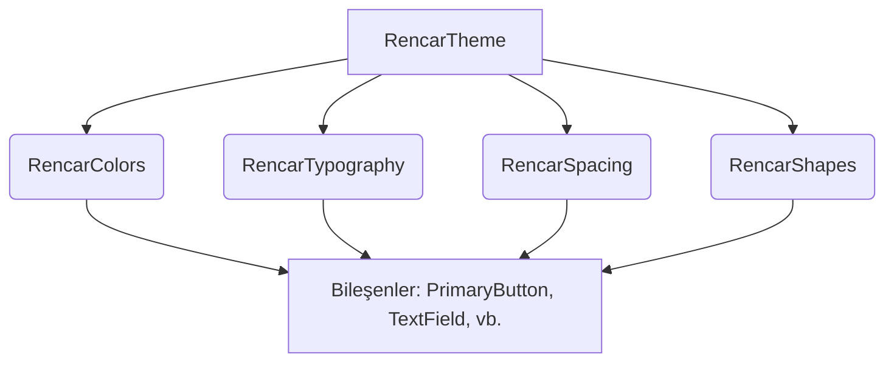

# RenCar Android Tasarım Sistemi (Design System) Kılavuzu

Bu doküman, RenCar Android mobil uygulamasında yer alan renk, tipografi, boşluk, ikon ve animasyon token'larının nasıl bir araya gelerek bütüncül bir tasarım sistemi oluşturduğunu açıklar. Tasarım belgesinde (`rencar.pdf`) belirtilen modern, yüksek kaliteli ve tutarlı kullanıcı deneyimi hedeflenmiştir.

---

## 1. Tasarım Sisteminin Yapısı

RenCar Tasarım Sistemi, Jetpack Compose temellerine uygun olarak modüler bir biçimde inşa edilmiştir. Bileşenler doğrudan ham değerleri (`literal values`) kullanmak yerine tasarım sistemi token'larını tüketir.



---

## 2. Merkezi Tasarım Sistemi Teması (RencarTheme)

Tüm alt bileşenlerin erişebileceği özel yerel değerleri (`CompositionLocal`) barındıran merkezi tema yapısı şu şekildedir:

```kotlin
import androidx.compose.foundation.isSystemInDarkTheme
import androidx.compose.material3.MaterialTheme
import androidx.compose.runtime.Composable
import androidx.compose.runtime.CompositionLocalProvider

@Composable
fun RencarTheme(
    darkTheme: Boolean = isSystemInDarkTheme(),
    content: @Composable () -> Unit
) {
    // 1. Renk Şeması Seçimi
    val colorScheme = if (darkTheme) DarkColorScheme else LightColorScheme

    // 2. Özel Boşluk Tanımlamalarının Sağlanması
    CompositionLocalProvider(
        LocalRencarSpacing provides RencarSpacing()
    ) {
        MaterialTheme(
            colorScheme = colorScheme,
            typography = RencarTypography,
            shapes = RencarShapes,
            content = content
        )
    }
}

// Kolay Erişim Uzantısı (Extension)
object RencarTheme {
    val spacing: RencarSpacing
        @Composable
        get() = LocalRencarSpacing.current
}
```

---

## 3. Token Entegrasyon Örneği

Tasarım sistemi kurallarının tamamını (boşluk, renk, şekil ve tipografi) tek bir araç kartı bileşeninde (`rencar.pdf` Sayfa 11) birleştiren kod örneği:

```kotlin
import androidx.compose.foundation.background
import androidx.compose.foundation.layout.*
import androidx.compose.material3.Card
import androidx.compose.material3.CardDefaults
import androidx.compose.material3.MaterialTheme
import androidx.compose.material3.Text
import androidx.compose.runtime.Composable
import androidx.compose.ui.Modifier
import androidx.compose.ui.text.font.FontWeight

@Composable
fun VehicleSummaryCard(
    vehicleName: String,
    pricePerMin: String,
    modifier: Modifier = Modifier
) {
    Card(
        modifier = modifier
            .fillMaxWidth()
            .padding(RencarTheme.spacing.medium), // Spacing Token
        shape = MaterialTheme.shapes.large, // Shape Token (16.dp)
        colors = CardDefaults.cardColors(
            containerColor = MaterialTheme.colorScheme.surface // Surface Color
        )
    ) {
        Column(
            modifier = Modifier.padding(RencarTheme.spacing.large)
        ) {
            Text(
                text = vehicleName,
                style = MaterialTheme.typography.titleMedium, // Typography Token
                color = MaterialTheme.colorScheme.onSurface, // Text Color
                fontWeight = FontWeight.Bold
            )
            Spacer(modifier = Modifier.height(RencarTheme.spacing.small))
            Text(
                text = "$pricePerMin / dk",
                style = MaterialTheme.typography.bodyLarge, // Typography Token
                color = MaterialTheme.colorScheme.primary // Primary Brand Color
            )
        }
    }
}
```

---

## 4. Tasarım Sisteminin Korunması ve Sınırları

1. **Özel Kodlama (Hardcoding) Yasağı:** Projede kodlanan hiçbir bileşende `Color(0xFF...)` veya `16.dp` gibi doğrudan tanımlamalar yer almamalıdır. Her şey temadan okunmalıdır.
2. **Material 3 Uyumluluğu:** Uygulama tasarımı Google'ın Material 3 standartları üzerine kurulmuştur. Bu yüzden M3 standart bileşenleri (`Button`, `Card`, `TextField`) tasarım sistemimizle sarmalanarak özelleştirilecektir.
3. **Ekran Çözünürlüğü Esnekliği:** Spacing ve Grid sistemi sayesinde arayüzler, küçük ekranlı cihazlardan büyük ekranlı cihazlara kadar otomatik olarak hizalanır ve taşma problemleri önlenir.
